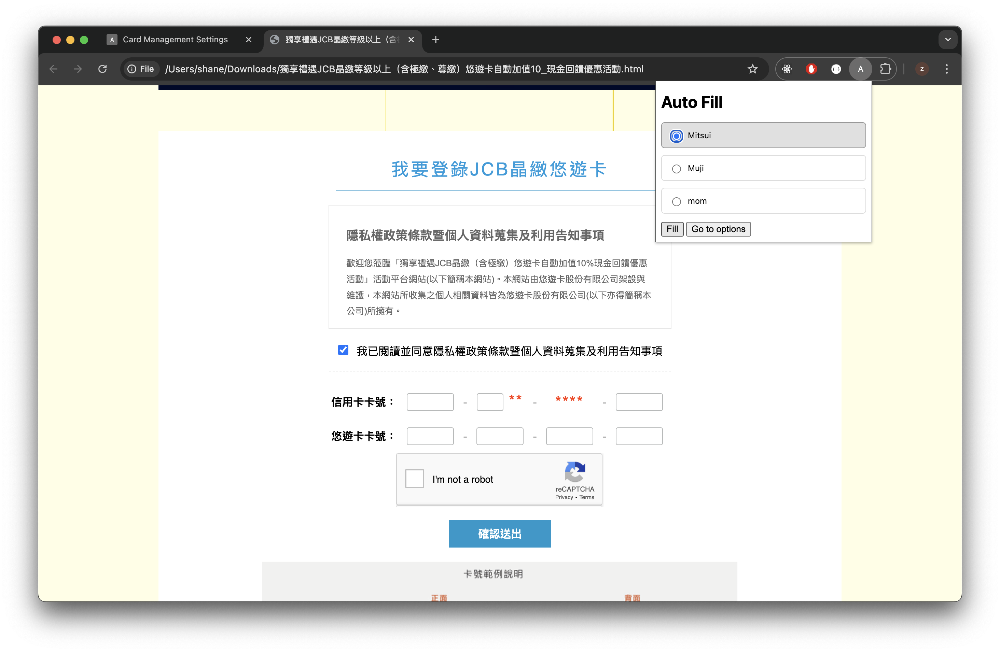

# jcb-autofill

A chrome extention can autofill [JCB event page](https://ezweb.easycard.com.tw/Event01/JCBLoginServlet)

## Features

1. option page can setup card information
2. click `fill` icon to fillup the [JCB event page](https://ezweb.easycard.com.tw/Event01/JCBLoginServlet) form

## Snapshot

## Try it

1. Install chrome extention
2. Go to [JCB event page](https://ezweb.easycard.com.tw/Event01/JCBLoginServlet) or serve page your self for testing(e.g. `npx serve ./jcb-event-page`).

## Demo

[Video](https://youtu.be/e_C7zHSiEhQ)
